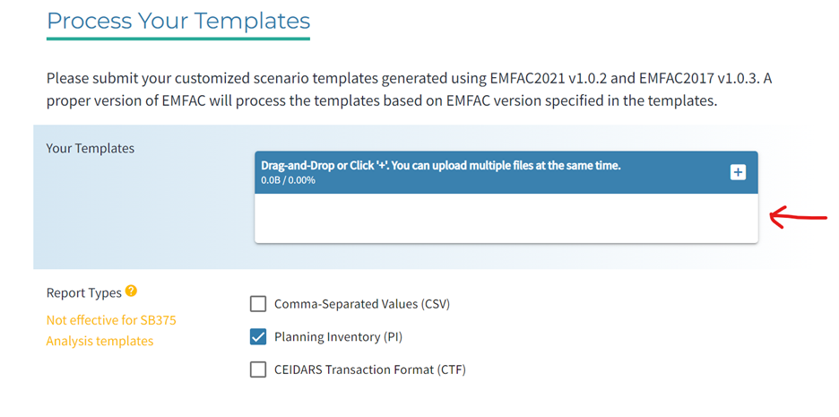

# README: EMFAC2017-EMFAC2021 Report Tool User Guide

**Author:** Michael Wehrmeyer

**Date:** Oct 5, 2022 
revised and pushed to GitHub Dec 5, 2022
<br/><br/>

## Purpose: 
Generate EMFAC emission estimates from completed SANDAG model scenarios. 
<br/><br/>

## Initial Set-up:
In your Anaconda Prompt (Anaconda3) command prompt, navigate to your project's analsysis directory. Then, clone the repository by running: ```git clone https://github.com/SANDAG/ABM-Reporting.git```. This requires git and GitHub to be configured on your local computer. If this is not the case, go here first: https://docs.github.com/en/get-started/quickstart/set-up-git

If it’s your first time running EMFAC analyses, you should read in an environment YAML file (which in turn creates/clones an Anaconda environment) into your instance of Anaconda. By reading in the environment file, it ensures you will be running the Python script with all the relevant libraries required to run the Python scripts.  

To create the environment, in Anaconda3 command prompt in the directory that the ABM-Reporting folder was cloned into, enter in the following command: 
```conda env create -f "ABM-Reporting-master\python\emfac\environment.yml" ```

If no errors appear, you can check if the environment was created/cloned successfully by typing in the following command: 
```conda env list ```

A list should appear with all your Anaconda virtual environments including the default “base” and newly created “emfac”. 
<br/>

## Steps:
1.	Obtain required scenario IDs.
<br/>

2.	Generate EMFAC input files.\
    Open run_emfac_input.bat in text editor of choice. Alternatively, user can create their own .bat file or enter Python commands directly into Anaconda Prompt. Regardless, the batch file generates templates for the specified EMFAC model for specified model scenario and time period into directory of choice (the "input path"). Users can also choose whether EMFAC Model 2014 templates should have the SB375 configuration.\
    Commands to enter into .bat file or into command prompt:
    ```python [Path to emfac_xlxs.py script] [EMFAC model year (2014|2017|2021)] [Scenario ID] [Time period for analysis (Annual|Summer|Winter|] [SB375 Switch (On|Off)] [Path to place EMFAC input files]```

    Example: 
    ```python T:\projects\sr14\OWP\2021rp_followup_ruc\abm_runs\emfac\emfac_xlsx.py 2017 709 Winter Off T:\projects\sr14\OWP\2021rp_followup_ruc\abm_runs\emfac\emfac2017\inputs```\
    *Note*: User can enter multiple python commands, each on their own line, into .bat file\
<br/>
 
3.	Use EMFAC online web tool (for EMFAC2017 & EMFAC2021)\
    Open EMFAC Web Tool, located here: https://arb.ca.gov/emfac/scenario-analysis/process-templates
    Drag the files that were generated in Step 2 into box indicated below. Set Report Type to “Planning Inventory (PI).\
    
 
    When all files are uploaded, click “Process Templates” as indicated below. Note that more than one file can be entered at a time.\ 
    

    Select indicated button after file is processed to download zipped EMFAC data. Repeat for every file.\
    

    *Then*, unzip downloaded zipped files and place in desired output folder. 
<br/>

4.	Summarize EMFAC tool outputs.\
    Open command prompt of user’s choice. Enter command to place summary file in output folder:
    ```python [Path to process_aq.py file] [Model Year (2014|2017|2021)] [Path to folder containing EMFAC tool output files] [Scenario IDs]```

    Example: ```python T:\projects\sr14\OWP\2021rp_followup_ruc\abm_runs\emfac\process_aq.py 2017 T:\projects\sr14\OWP\2021rp_followup_ruc\abm_runs\emfac\emfac2017\outputs 739 741 740 708 709 737 742```

